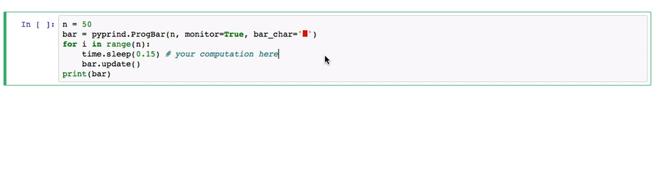

# PyPrind (Python Progress Indicator)

The `PyPrind` (Python Progress Indicator) module provides a **progress bar** and a **percentage indicator** object that let you track the progress of a loop structure or other iterative computation.  
Typical applications include the processing of large data sets to provide an intuitive estimate
at runtime about the progress of the computation.

 

#### Progress Bars and Percentage Generators

 
 

<a id='advanced_tracking'>

#### Advanced Tracking

 
 

#### Choose Your Favorite Bar Style

 
 

###[View more examples in an IPython Demo Notebook](http://nbviewer.ipython.org/github/rasbt/pyprind/blob/master/examples/pyprind_demo.ipynb)

 
 

<a id='sections'>

# Sections

- [Installation](#installation)
- [Documentation](#documentation)
- [Examples](#examples)
- [Contact](#contact)
- [Changelog](https://raw.githubusercontent.com/rasbt/pyprind/master/CHANGELOG.txt)

 
 
 

# Installation

[[back to top](#sections)]

The most convenient way to install PyPrind is via tools like `pip` or `easy_install`:

- `pip install pyprind`  

-  `easy_install pyprind`  

PyPrind comes without any dependencies except for the optional [psutil](https://pypi.python.org/pypi/psutil) to [monitor CPU and memory usages](#advanced_tracking). You can install `psutil` via `pip install psutil` or install it automatically with PyPrind:  
 `pip install pyprind -r requirements.txt`

Alternatively, you can install PyPrind the classic way: Download the package from the Python Package Index [https://pypi.python.org/pypi/PyPrind](https://pypi.python.org/pypi/PyPrind), unzip it, navigate into the unzipped directory, and use the command

`python setup.py install`  

 
 
 

# Documentation

[[back to top](#sections)]

PyPrind consists of two class objects that can visualize the progress of a computation on the output screen.  
Progress bars are available via `ProgBar`, and percentage indicators can be used via a `ProgPercent`.  

	n = 10000000
	bar = pyprind.ProgBar(n)   # 1) initialization with number of iterations
	for i in range(n):
    	# do some computation
    	bar.update()           # 2) update the progress visualization

Alternatively, the progress can be tracked via the equivalent generator functions `prog_bar` and `prog_percent`:

	for i in pyprind.prog_bar(range(n)):
    	# do something
    	pass

 

#### Complete Parameter of Parameters and Options

##### ProgBar

*`ProgBar(iterations, track_time=True, width=30, bar_char='#',
               stream=2, title='', monitor=False, update_interval=None))`*

- iterations : `int`  
    Number of iterations for the iterative computation.
- track_time : `bool` (default: `True`)  
    Prints elapsed time when loop has finished.
- width : `int` (default: 30)  
    Sets the progress bar width in characters.
- stream : `int` (default: 2).  
    Setting the output stream.
    Takes `1` for stdout, `2` for stderr, or a custom stream object
- title : `str` (default:  `''`)  
    Setting a title for the progress bar.
- monitor : `bool` (default: `False`)  
    Monitors CPU and memory usage if `True` (requires `psutil` package).
- update_interval : float or int (default: `None`)  
    The update_interval in seconds controls how often the progress
    is flushed to the screen.
    Automatic mode if `update_interval=None`.

##### ProgPercent

*`ProgPercent(iterations, track_time=True,
               stream=2, title='', monitor=False, update_interval=None)`*

- iterations : `int`  
    Number of iterations for the iterative computation.  
- track_time : `bool` (default: `True`)  
    Prints elapsed time when loop has finished.
- stream : `int` (default: 2).  
    Setting the output stream.
    Takes `1` for stdout, `2` for stderr, or a custom stream object
- title : `str` (default : `''`).  
    Setting a title for the percentage indicator.
- monitor : `bool` (default: `False`)  
    Monitors CPU and memory usage if `True` (requires `psutil` package).
- update_interval : float or int (default: `None`)  
    The update_interval in seconds controls how often the progress
    is flushed to the screen.
    Automatic mode if `update_interval=None`.

##### update method

*`update(iterations=1, item_id=None, force_flush=False)`*

- iterations : int (default: `1`)  
    default argument can be changed to integer values
    `>=1` in order to update the progress indicators more than once
    per iteration.
- item_id : str (default: `None`)  
    Print an item_id sring behind the progress bar
- force_flush : bool (default: `False`)  
    If True, flushes the progress indicator to the output screen
    in each iteration.

 

 
 
 

# Examples

[[back to top](#sections)]

Examples for using the progress bar and percentage indicator objects can be found in the [IPython Demo Notebook](https://github.com/rasbt/pyprind/blob/master/examples/pyprind_demo.ipynb).

 
 
 

#  Contact

[[back to top](#sections)]

If you have any questions or comments about `PyPrind`, please feel free to contact me via  
eMail: [mail@sebastianraschka.com](mailto:mail@sebastianraschka.com)  
or Twitter: [@rasbt](https://twitter.com/rasbt)

The `pyprind` module is available on GitHub at [https://github.com/rasbt/pyprind](https://github.com/rasbt/pyprind).
