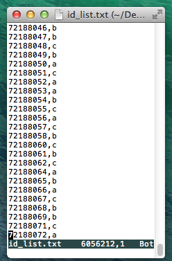
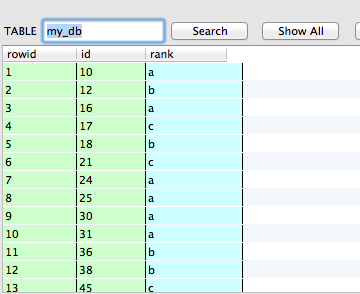
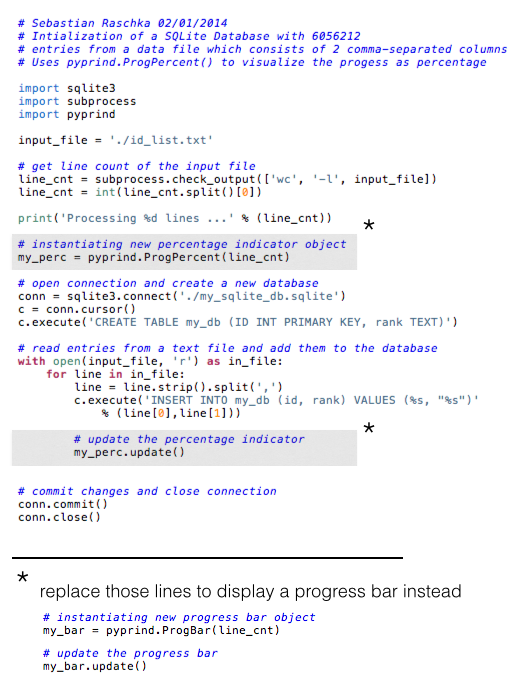

#PyPrind - A simple Python Progress Indidicator Utility

Sometimes it can be useful to display the progress of a computation, especially for more intensive tasks. I have written a simple module that tracks the progress of iterative Python procedures via a progress bar or percentage indicator. I've been using this tool for a while now, and I thought that it might be worthwhile to share it with you in hope it can also be useful to one or the other.

So, your initial question is probably: "how does this progress tracking look like?"
I don't want to push your visual thinking to its limit here (or rather my capabilities to put this visual image into written words), thus I just uploaded a simple video on YouTube to show you how it looks like.  

<iframe width="420" height="315" src="//www.youtube.com/embed/GC2J0SMmiWQ" frameborder="0" allowfullscreen></iframe>

###Download and Installation:

The PyPrind module works with both Python 2.7 and Python 3.3, and it can be downloaded directly from the Python Package Index ([https://pypi.python.org/pypi/PyPrind](https://pypi.python.org/pypi/PyPrind)) to install it via

	python setup.py install
	
If you don't want to download and install the module manually, you can also use  `pip install pyprind` or `easy_install pyprind` from the command line.  

You are also welcome to fork the project on GitHub: [https://github.com/rasbt/pyprind](https://github.com/rasbt/pyprind) 

###Usage

Currently, I implemented two ways to track a progress via PyPrind. This can be either by a classic progress bar or via a percentage indicator. Both options require just a simple 2-step process:   

1) initialization of the progress-tracking object with the number of iterations  
2) calling the `.update()` method  

I kept the progress tracking rather simple on purpose, in order to minimize performance losses.

Below are two simple examples:

<pre>n = 10000000
my_prbar = pyprind.ProgBar(n)   # 1) initialization with number of iterations
for i in range(n):	
    # do some computation
    my_prbar.update()           # 2) update the progress visualization
</pre>

<pre>n = 10000000
my_prperc = pyprind.ProgPercent(n) # 1) initialization with number of iterations
for i in range(n):	
    # do some computation
    my_prerc.update()              # 2) update the progress visualization
</pre>

For optional parameters, like adjusting the width of the progress bar and turning-off the live-time tracking of the percentage indicator, please refer to the documentation at [http://pythonhosted.org//PyPrind/](http://pythonhosted.org//PyPrind/)

###Example Application - SQLite database operations

I am working a lot with SQLite databases these days and found it very useful to use progress tracking to get an rough idea of how much data was already processed and to estimate how long an operation could take.  In the example below I have provided some simple code to initialize a SQLite database and feed it IDs from a list in text format.  
The ID list consists of 6,056,212 rows where each row consists of a unique ID number associated with a certain category 'a', 'b', 'c', or 'd'.  
The figure below shows how this ID file looks like:  

For the SQLite database, I am using an integer column to save the IDs (as Primary Key) for performance reasons. The second column is a text column that contains the categorical information. The image below is a screenshot from FireFox's [SQLite Manager plugin](https://addons.mozilla.org/en-US/firefox/addon/sqlite-manager/):

And here is the Python code that I used to create this SQLite database:

The two YouTube videos show how the execution looks like:

<iframe width="560" height="315" src="//www.youtube.com/embed/EUBAYU_JczY" frameborder="0" allowfullscreen></iframe>
 
 <iframe width="560" height="315" src="//www.youtube.com/embed/f6S9fXFwTmg" frameborder="0" allowfullscreen></iframe>

#### Performance

I was also interested to see how big the performance loss of the overall database initialization is if I track the progress via the PyPrind objects. And, based on the results, it looks quite reasonable: Using PyPrind's progress bar visualization resulted in a 20.8347 sec longer CPU time for the 6,056,212 iterations in the data processing loop. As expected, PyPrind's percentage indicator used a little bit more resources and added 40.4861 sec of CPU time.  
The results (average values with variances as error bars) are shown in the bar plot below.

Using a simple rule of three we can deduce that for PyPrind's progress bar ~300,000 iterations cost 1 sec extra CPU time here, and PyPrind's percent indicator requires 1 sec of extra CPU time for every ~150,000 iterations.
Of course those are only rough measurements, which are also subject to the machine you are running the computation.  
For me, is was quite sufficient to know that PyPrind does not have a huge impact on the overall performance, but if you are interested in more detailed performance profiles, you can take a look at [http://docs.python.org/3.3/library/profile.html]()the Python Profilers) and analyze your script via 
`python -m cProfile your_code.py`

**So, I hope this simple progress tracking tool could be useful to you, and please let me know if you have any ideas or suggestions!**
 

